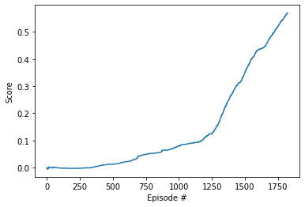

# Learning Algorithm

## Deep Deterministic Policy Gradient (DDPG)
I chose the DDPG algorithm and adapeted the version that solved the Reacher environment successfully. 
Deep Deterministic Policy Gradient (DDPG) was first described by Lillicrap et al. in [this paper](https://arxiv.org/abs/1509.02971). The underlying idea was to circumvent the disadvantages of both policy-based and model based aproches. The authors claim DDPG to be "an actor-critic, model-free algorithm based on the deterministic policy gradient that can operate over continuous action spaces". 
This is achieved as follows:  
DDPG has actor network to choose and execute its action and a critic network that estimates/approximates the value of the optimal action-value function Q^*(s,a) (similar to Q-learning). But unlike Q-learning, the critic does this for environments with continuous action spaces. Furthermore there is a target network for each actor and critic which is soft-updated after each learning interval. So DDPG can be thought of as being deep Q-learning for continuous action spaces.  DDPG uses a Replay buffer that saves the actions, steps and rewards and next states. This shall lead to a more stable behaviour of the training process. 

### Design of the networks
The introduction of batch-normalization for the first layer of the actor as well as the critic network lead to a more steady training without increasing the training time to much. 
In my opinion the task should not be that complex for the ddn model, so I chose smaller sized networks with 128 hidden units in the first layer and 64 in the second, which seemed to be pretty good.

## Parameters
```BUFFER_SIZE = int(1e6)  # replay buffer size
BATCH_SIZE = 512   # minibatch size
GAMMA = 0.99            # discount factor
TAU = 1e-3              # for soft update of target parameters
LR_ACTOR = 1e-3         # learning rate of the actor 
LR_CRITIC = 1e-3        # learning rate of the critic
WEIGHT_DECAY = 0.00001        # L2 weight decay
UPDATE_INTERVAL = 5 
LEARN_PASSES=10 
EPSILON=5
EPSILON_DECAY=1e-5 #decay rate for added noise (exploration)
```
Most important here were the noise parameters especially EPSILON and the seed value.  
A higher Epsilon of 5 or 6 lead to significantly better results at first few hundred episodes of the training process. This was not for every seed the case, but for a few like `seed = 5` or `seed = 7` or `seed = 8`.

The implementation of Epsilon decay to reduce the noise and therefor the probability that a random action is taken later in the training process seemd to be beneficial. 

## Plot of Rewards:
The Plot showing an average reward over 0.5 can be found in Tennis.ipynb and here:  
.  
After consecutive 100 episodes with mean rewards > 0.5 the training was successfully stopped. This was the case after episode 1821.

# Ideas for Future Work:
Tuning the DDPG algorithm required a lot of trial and error. Especially the dependency on the random seed was a downside in my opinion. So more research should be done on how this dependency on a randomnes at the initialization can be reduced. Probably for this task/application other reinforcement learning algorithms are more beneficial. 
Perhaps other algorithms like [Proximal Policy Optimization (PPO)](Proximal Policy Optimization Algorithms), or Distributed Distributional Deterministic Policy Gradients (D4PG) would be more robust.

Also prioritized experience replay may be a good idea here. That means in the learning step instead of randomly selecting episodes from the replay buffer searching for episodes that had a reward bigger than a certain reference value.
